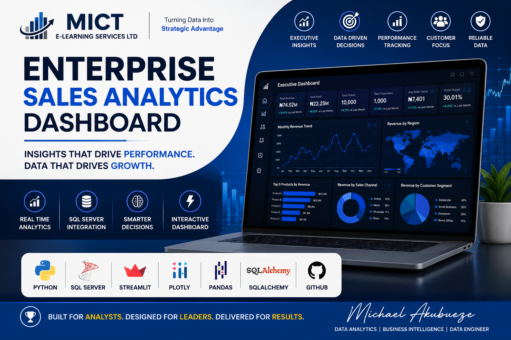

<p align="center">

</p>

<h1 align="center">📊 Enterprise Sales Analytics Dashboard</h1>

<p align="center">


</p>

---

# 🚀 Overview

The **Enterprise Sales Analytics Dashboard** is a professional Business Intelligence solution built with **Python**, **SQL Server**, **Streamlit**, **Pandas**, **SQLAlchemy**, and **Plotly**.

It transforms raw transactional sales data into meaningful executive insights through interactive dashboards, SQL analytics, and modern data visualization.

This project demonstrates enterprise-level skills in:

- Business Intelligence
- Data Analytics
- SQL Server Development
- Python Programming
- Dashboard Design
- Data Visualization
- Executive Reporting

---

# 🎯 Business Objectives

This dashboard enables executives and business managers to answer key questions such as:

- How much revenue has the business generated?
- Which regions perform best?
- Which customer segments generate the highest profit?
- Which products should receive more investment?
- Which months generate the highest revenue?
- What is the average order value?
- Which sales channels drive business growth?

---

# 📸 Dashboard Preview

## Executive Dashboard

> *(Dashboard screenshot to be added)*


---

# ✨ Key Features

## Executive KPIs

- Total Revenue
- Total Profit
- Total Orders
- Total Customers
- Average Order Value
- Gross Margin

---

## Interactive Analytics

- Monthly Revenue Trend
- Monthly Profit Trend
- Regional Sales Analysis
- Customer Segmentation
- Product Performance
- Category Performance
- Sales Channel Analysis
- Top Performing Products

---

## Database Integration

- SQL Server 2022
- SQLAlchemy ORM
- Live Database Connection
- Dynamic SQL Queries

---

## Professional Dashboard

- Streamlit Web Application
- Plotly Interactive Charts
- Executive Dashboard Layout
- Modern UI Design

---

# 🛠 Technology Stack

| Technology | Purpose |
|------------|----------|
| Python | Analytics Engine |
| SQL Server | Enterprise Database |
| SQLAlchemy | Database Connectivity |
| Pandas | Data Processing |
| Plotly | Interactive Visualization |
| Streamlit | Dashboard |
| Git | Version Control |
| GitHub | Portfolio |
| VS Code | Development |

---

# 📂 Project Structure

```text
Enterprise-Sales-Analytics-Dashboard

│
├── app.py
├── dashboard.py
├── charts.py
├── database.py
├── queries.py
├── kpi.py
├── config.py
├── styles.py
│
├── assets
│   ├── github_cover.png
│   └── dashboard_home.png
│
├── charts
│
├── data
│
├── reports
│
├── README.md
│
└── requirements.txt
```

---

# 📈 Current Executive KPIs

| KPI | Value |
|------|-------:|
| Revenue | ₦74.02 Million |
| Profit | ₦22.25 Million |
| Orders | 10,000 |
| Customers | 1,000 |
| Average Order Value | ₦7,402 |
| Gross Margin | 30.01% |

---

# 📊 Planned Dashboard Pages

### Executive Dashboard

✔ Revenue

✔ Profit

✔ Orders

✔ Customers

✔ Gross Margin

---

### Sales Analytics

- Monthly Revenue
- Monthly Profit
- Quarterly Performance
- Year-over-Year Growth

---

### Customer Analytics

- Customer Segmentation
- Customer Lifetime Value
- Customer Distribution

---

### Product Analytics

- Best Selling Products
- Low Performing Products
- Product Profitability

---

### Regional Analytics

- Sales by Region
- Sales by Country
- Regional Revenue Comparison

---

### Executive Insights

- AI-generated Insights
- Business Recommendations
- Forecasting

---

# ⚙ Installation

Clone the repository

```bash
git clone https://github.com/MichaelAkubueze/Enterprise-Sales-Analytics-Dashboard.git
```

Open the project

```bash
cd Enterprise-Sales-Analytics-Dashboard
```

Install dependencies

```bash
pip install -r requirements.txt
```

Run the dashboard

```bash
streamlit run dashboard.py
```

---

# 📌 Future Improvements

- Artificial Intelligence Executive Assistant
- Revenue Forecasting
- Customer Lifetime Value
- RFM Analysis
- ABC Analysis
- Inventory Dashboard
- Financial Dashboard
- HR Dashboard
- Supply Chain Dashboard

---

# 👨‍💻 Developer

## Michael Akubueze

### MICT E-LEARNING SERVICES LTD

Enterprise Data Analytics

Business Intelligence

SQL Server Development

Python Programming

Dashboard Development

---

# 📫 Contact

**Email**

michaelakubueze@example.com

*(Replace with your preferred email address.)*

---

# ⭐ Support

If you found this project useful:

⭐ Star this repository

🍴 Fork the repository

📢 Share it with others

---

# 📜 License

This project is released under the MIT License.

---

<p align="center">

### Built with ❤️ using Python, SQL Server and Streamlit

**MICT E-LEARNING SERVICES LTD**

</p>